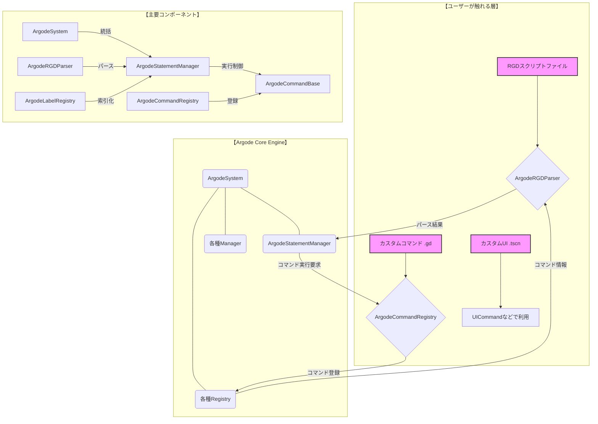

# Argode 設計思想ドキュメント

## 1. はじめに

Argodeは、Godot Engine上で高機能なノベルゲームやアドベンチャーゲームを効率的に開発するために設計された、総合的な対話・物語システムです。

このドキュメントは、Argodeの内部構造と設計思想を解説し、開発者がそのポテンシャルを最大限に引き出すことを目的としています。

### 設計の哲学

Argodeは、以下の3つの哲学に基づいています。

1.  **パフォーマンスとスケーラビリティ**: プロジェクトが大規模になっても、起動時間や実行時のパフォーマンスが低下しないこと。これを実現するため、**遅延パース（Lazy Parsing）**や**インデックス化（Indexing）**などの技術を積極的に採用しています。
2.  **高い拡張性と柔軟性**: 開発者が独自のコマンド、UI、特殊効果を簡単に追加・変更できること。システムの各コンポーネントは疎結合に設計されており、必要な部分だけをオーバーライドできます。
3.  **直感的で強力なスクリプト**: `RGD`という独自のスクリプト言語により、シナリオライターがプログラミングの深い知識なしに、複雑な演出や分岐を直感的に記述できること。

---

## 2. アーキテクチャ概要

Argodeは、それぞれが明確な責務を持つ複数のコンポーネントに分割されています。これにより、システムの各機能が独立し、メンテナンスと拡張が容易になっています。



-   **System (`ArgodeSystem`)**: 全てを統括するシングルトン。各マネージャーやレジストリを初期化し、全体へのアクセスを提供します。
-   **Parser (`ArgodeRGDParser`)**: `.rgd`ファイルを読み込み、実行可能な「ステートメント」のリストに変換します。
-   **Registries (`Argode...Registry`)**: ゲーム起動時に、コマンド、ラベル、定義などをスキャンして索引化（インデックス化）し、高速にアクセスできるようにします。
-   **Statement Manager (`ArgodeStatementManager`)**: Parserが生成したステートメントリストを受け取り、ゲームの実行フローを制御します。
-   **Commands (`ArgodeCommandBase`)**: `say`や`show`など、個々の命令の具体的な処理を実装したクラス群です。

---

## 3. 起動シーケンス：パフォーマンスの秘訣

Argodeは、大規模なプロジェクトでも高速に起動するために、巧みな初期化シーケンスを採用しています。

1.  **プラグイン有効化**: Godotエディタでプラグインを有効にすると、`ArgodeSystem`がオートロード（シングルトン）として自動的に登録されます。

2.  **`ArgodeSystem` 起動**: ゲームが開始されると、`ArgodeSystem`が起動し、各種マネージャー（`LayerManager`, `Controller`など）を初期化します。

3.  **レジストリによる索引化（Indexing）**: ここがパフォーマンスの鍵です。`ArgodeSystem`は、3つの主要なレジストリを順次実行します。
    -   **① `ArgodeCommandRegistry` (コマンド登録)**: `builtin/commands`とカスタムコマンドディレクトリをスキャンし、使用可能な全てのコマンド（`.gd`ファイル）をインスタンス化して辞書に登録します。これにより、どの文字列がコマンドなのかを即座に判定できます。
    -   **② `ArgodeDefinitionRegistry` (定義収集)**: `definitions`ディレクトリ内の`.rgd`ファイルを**パース**し、`character`や`set`のような「定義コマンド」だけを抽出します。
    -   **③ `ArgodeLabelRegistry` (ラベル索引化)**: `scenarios`ディレクトリ内の`.rgd`ファイルを**パースせず**、テキストとして高速にスキャンします。`label`で始まる行だけを見つけ出し、「ラベル名」と「ファイルパス・行番号」を紐づけた辞書を作成します。これにより、何百ものシナリオファイルがあっても、ジャンプ先の探索が瞬時に完了します。

4.  **定義の実行**: `ArgodeDefinitionRegistry`が収集した定義コマンド（キャラクターや変数など）を`ArgodeStatementManager`が実行します。これにより、シナリオ開始前に必要な全ての定義が準備完了状態になります。

5.  **待機状態へ**: 全ての初期化が完了すると、ローディング画面を終了し、`play()`が呼び出されるのを待ちます。

この**「シナリオ本文は実行時までパースしない（遅延パース）」**という設計により、プロジェクトの規模に関わらず、起動時間はほぼ一定に保たれます。

---

## 4. 実行フロー：`play()`が呼ばれてから

`ArgodeSystem.play("start")`のように、ラベルを指定して実行が指示されると、以下のプロセスが進行します。

1.  **ラベル検索**: `ArgodeStatementManager`は`ArgodeLabelRegistry`に問い合わせ、指定されたラベル（例: "start"）がどのファイルの何行目にあるかを瞬時に取得します。

2.  **遅延パース (Lazy Parsing)**: `ArgodeStatementManager`は、取得したファイルパスを`ArgodeRGDParser`に渡します。パーサーは、**この時初めて対象の`.rgd`ファイル1つだけを読み込み**、実行可能なステートメントのリストに変換します。

3.  **ステートメント実行**: `ArgodeStatementManager`は、パースされたステートメントリストを上から順に実行していきます。

4.  **コマンド実行**: 各ステートメントに到達すると、`StatementManager`は`ArgodeCommandRegistry`から対応するコマンドのインスタンス（例: `SayCommand`）を取得し、その`execute()`メソッドを呼び出します。

5.  **レンダリングと処理**: 呼び出されたコマンドは、`ArgodeMessageRenderer`にテキスト描画を依頼したり、`ArgodeLayerManager`にキャラクター画像の表示を指示するなど、それぞれの具体的な処理を実行します。

---

## 5. 主要コンポーネント詳細

| 役割 | クラス名 | 説明 |
| :--- | :--- | :--- |
| **コア** | `ArgodeSystem` | システム全体を管理するシングルトン。各コンポーネントを初期化し、統括する。 |
| **実行制御** | `ArgodeStatementManager` | パースされたステートメントリストの実行フロー（どの行を次に実行するか）を管理する、いわば物語の「指揮者」。 |
| **スクリプト解析** | `ArgodeRGDParser` | `.rgd`ファイルを読み込み、インデントや構文を解釈して、`StatementManager`が実行できるステートメントのリストに変換する。 |
| **コマンド基底** | `ArgodeCommandBase` | 全てのコマンドが継承する基底クラス。`execute()`メソッドのインターフェースを定義する。 |
| **コマンド登録** | `ArgodeCommandRegistry` | プロジェクト内の全コマンドを起動時にスキャン・登録し、コマンド名と実体を紐づける辞書を管理する。 |
| **定義登録** | `ArgodeDefinitionRegistry` | `character`や`set`など、シナリオ実行前に準備が必要な「定義」を管理する。 |
| **ラベル登録** | `ArgodeLabelRegistry` | 全シナリオファイル内の`label`を高速にスキャンし、ジャンプ先を記録した索引（インデックス）を作成する。 |
| **入力管理** | `ArgodeController` | Godotの`InputMap`と連携し、プレイヤーの入力を一元管理する。 |
| **レイヤー管理** | `ArgodeLayerManager` | 背景・キャラクター・UIといった描画レイヤーを管理し、正しい重なり順を保証する。 |
| **変数管理** | `ArgodeVariableManager` | `set`/`get`コマンドで操作されるゲーム内変数を管理する。 |
| **ビュー基底** | `ArgodeViewBase` | メッセージウィンドウなど、Argodeで使われるUI要素の基底クラス。 |
| **レンダラー** | `Argode...Renderer` | メッセージ、キャラクター、背景など、各要素の実際の描画処理を担当する。 |
| **サービス** | `Argode...Service` | タイプライター効果やリッチテキスト変換など、特定の機能を提供する補助的なクラス群。 |

---

## 6. 拡張性

Argodeは、開発者が自由に機能を拡張できるように設計されています。

### カスタムコマンドの追加

1.  `ArgodeCommandBase`を継承した新しい`.gd`ファイルを作成します。
2.  `command_execute_name`（RGDで使うコマンド名）と`execute()`メソッドを実装します。
3.  作成したファイルをプロジェクト設定で指定された「Custom Command Directory」（デフォルト: `res://custom_commands/`）に配置します。

これだけで、`ArgodeCommandRegistry`が自動的に新しいコマンドを認識し、RGDスクリプトから利用できるようになります。

### カスタムUIの利用

`ui`コマンドは、引数として`.tscn`ファイルのパスを受け取ることができます。これにより、プロジェクト独自にデザインしたメッセージウィンドウや選択肢、特別なUI画面を簡単に表示できます。

```gdscript
# 独自に作成したセーブ画面を表示する
ui show "res://scenes/my_save_screen.tscn"
```

この柔軟な設計により、Argodeの基本機能を利用しつつ、ゲームの見た目や機能を完全にオリジナルなものにすることが可能です。

## 7. その他


以下は各クラスの役割と責任を表にしたものです。

| 役割 | クラス名 | 責任 |
| :--- | :--- | :--- |
| **コア** | `ArgodeSystem` | ・フレームワーク全体の統括<br>・マネージャー、サービスの生成と管理<br>・汎用的なヘルパー機能（ログ、ファイル読み込み）の提供 |
| **マネージャー** | `ArgodeStatementManager` | ・スクリプト実行フローの制御（司令塔）<br>・RGDパーサーが作成したデータの実行<br>・実行コンテキスト（スタック）と`await`の管理 |
|  | `ArgodeInlineCommandManager` | ・テキスト内のインラインコマンド（タグ）の解析と処理<br>・`TagTokenizer`、`TagRegistry`などのサービス連携 |
|  | `ArgodeVariableManager` | ・フレームワーク全体の動的変数の管理<br>・変数の設定（`set`コマンド）と取得（`get`コマンド） |
|  | `ArgodeLayerManager` | ・UIレイヤーのセットアップと状態管理<br>・キャラクターや背景の位置座標の定義と管理 |
|  | `ArgodeDebugManager` | ・デバッグ機能の専門的な管理<br>・ログ出力やデバッグ用UI表示の実際の処理 |
| **パーサー/レジストリ** | `ArgodeRGDParseService` | ・RGDファイルの完全な構文解析<br>・インデントやブロック構造をデータに変換<br>・構文エラーの検出とメタデータ（行番号など）の付与 |
|  | `ArgodeCommandRegistry` | ・GDScriptコマンドファイルの読み込みとインスタンス化<br>・コマンド名とインスタンス、メタ情報の一元管理 |
|  | `ArgodeDefinitionRegistry` | ・起動時に定義ファイルを高速で読み込み、定義コマンドを実行 |
|  | `ArgodeLabelRegistry` | ・起動時にシナリオファイルからラベル情報のみを高速で抽出・管理 |
| **サービス** | `ArgodeTypewriterService` | ・タイプライター演出のための文字分割とシグナル発行<br>・描画ロジックとは完全に分離 |
|  | `ArgodeTagTokenizer` | ・テキストをトークン（単語、記号）に分解する |
|  | `ArgodeTagRegistry` | ・タグ名と対応するコマンドクラスのマップを管理<br>・`ArgodeInlineCommandManager`に利用される |
|  | `ArgodeRichTextConverter` | ・テキストとタグをBBCodeに変換する<br>・ルビなどの独自描画に必要な情報を抽出 |
| **コマンド** | `ArgodeCommandBase` | ・フレームワークで使用するすべてのコマンドの抽象基底クラス |
| **レンダラー** | `ArgodeMessageRenderer` | ・最終的なメッセージの描画処理（タイプライター演出など） |
|  | `ArgodeRubyRenderer` | ・ルビの描画に特化したレンダラー |
