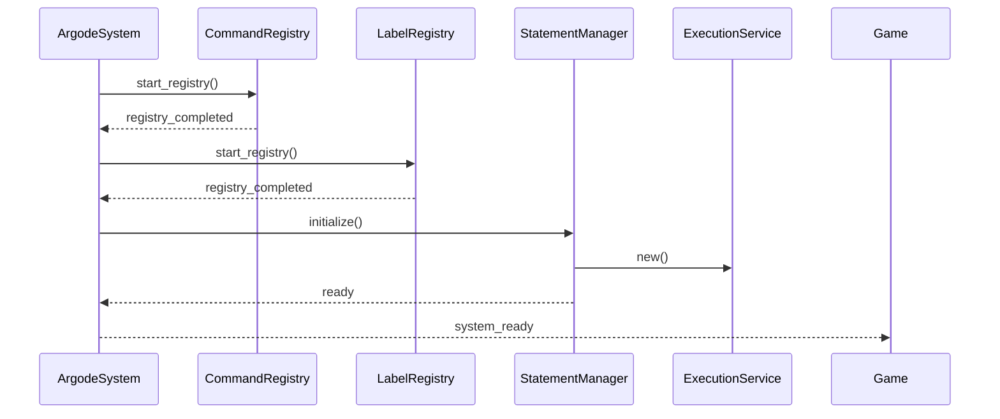
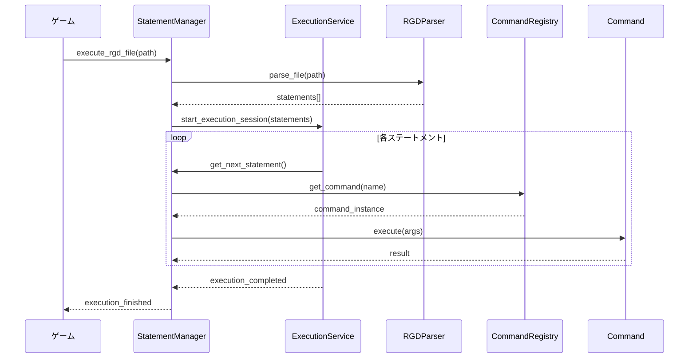
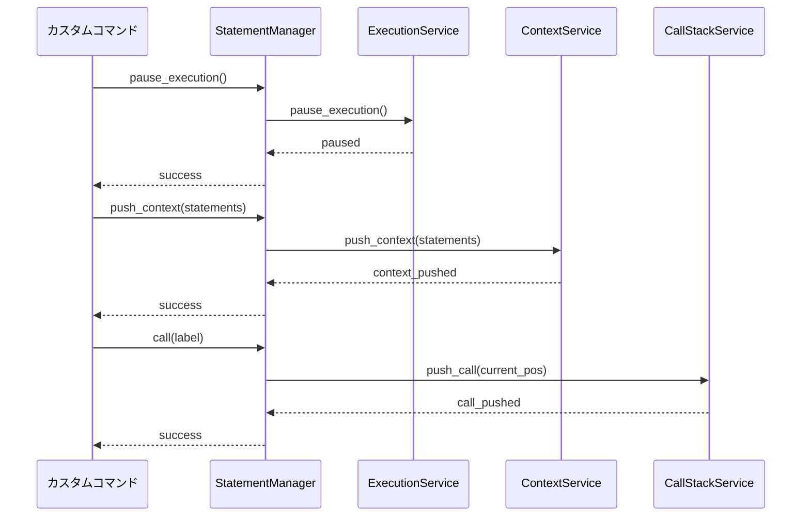
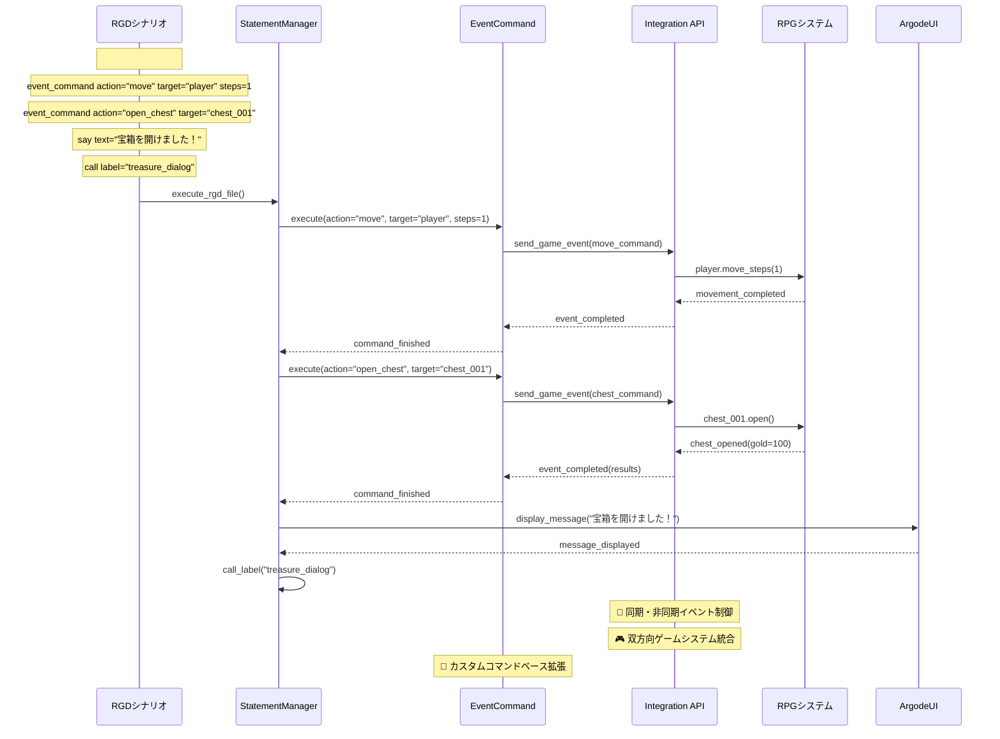

# Argode v1.2.0 フレームワーク完全設計書

## プロジェクト概要

**Argode v1.2.0** は、Godot Engine 4.x 系で動作する本格的なビジュアルノベルゲーム開発フレームワークです。
GDScript による記述を中心とし、RGD（Rule-based Game Description）言語を使用してストーリーとゲームロジックを記述できます。

リファクタリング過程で、Service Layer Pattern を基盤とした高度なアーキテクチャを実装しており、
拡張性・保守性・パフォーマンスを高次元で両立しています。

## 中核設計思想

### 1. 役割と責任の厳密な分離 (Separation of Concerns)

各クラスは単一の明確な役割に特化し、相互依存を最小限に抑制：

- **ArgodeSystem**: フレームワーク統括コア。マネージャー・サービス・レジストリのライフサイクル管理
- **Service Layer**: 実行制御、コンテキスト管理、パース処理など、ビジネスロジックの専門化
- **Manager Layer**: サービス層への統一API提供、後方互換性の維持
- **Registry Layer**: コマンド・ラベル・定義の高速検索インデックス
- **Command Pattern**: 全命令の独立実装による拡張性確保

### 2. Service Layer Pattern による内部アーキテクチャ

実装の複雑性を隠蔽しつつ、内部的には高度に専門化された Service 層で処理：

- **ExecutionService**: 実行フロー制御・状態管理
- **ContextService**: ネストした実行コンテキスト管理
- **CallStackService**: Call/Return スタック専用処理
- **InputHandlerService**: 入力制御・待機状態管理
- **UIControlService**: UI 制御とメッセージウィンドウ管理

### 3. 遅延パースとパフォーマンス最適化

- 起動時: **Registry** が必要最小限の情報（ラベル・定義）のみ高速読み込み
- 実行時: **RGDParser** によるオンデマンド・階層化パース
- メモリ効率: 不要なデータ構造を保持しない設計

### 4. 拡張性とカスタマイゼーション（v1.2.0の核心目標）

- **Command Pattern**: 全命令が `ArgodeCommandBase` 継承の独立クラス
- **Dynamic Loading**: `builtin/commands/` と `custom_commands/` からの自動発見
- **Tag System**: インラインコマンドの柔軟な拡張機能
- **独立開発可能性**: コマンドとして独立して開発でき、ArgodeSystemが汎用的に受け入れる構造

**v1.2.0の最重要事項**: ADVエンジンとしての最低限機能を**コマンドとして**実装可能な状態を実現し、ユーザーが容易にカスタムコマンドを追加できる基盤を確立する。

## 完全アーキテクチャ図

```mermaid
graph TB
    subgraph "External Integration (v1.2.1)"
        EXT[External Game Systems<br/>RPG・アクション・パズル]
        API[Argode Integration API<br/>統一アクセスポイント]
    end
    
    subgraph "ArgodeSystem Core"
        AS[ArgodeSystem<br/>統括・初期化・ログ]
    end
    
    subgraph "Manager Layer (統一API)"
        SM[StatementManager<br/>実行司令塔]
        DM[DebugManager<br/>デバッグ制御]
        LM[LayerManager<br/>表示レイヤー管理]
        VM[VariableManager<br/>変数管理]
        UM[UIManager<br/>UI統括]
        AM[AssetManager<br/>リソース管理]
        TM[TransitionManager<br/>場面転換]
        IM[InlineCommandManager<br/>インラインタグ]
    end
    
    subgraph "Service Layer (内部実装)"
        ES[ExecutionService<br/>実行制御]
        CS[ContextService<br/>コンテキスト管理]
        CSS[CallStackService<br/>Call/Return]
        IHS[InputHandlerService<br/>入力制御]
        UICS[UIControlService<br/>UI制御]
        VR[VariableResolver<br/>変数解決]
        TS[TypewriterService<br/>タイプライター]
    end
    
    subgraph "Registry Layer (高速検索)"
        CR[CommandRegistry<br/>コマンド登録]
        LR[LabelRegistry<br/>ラベルインデックス]
        DR[DefinitionRegistry<br/>定義インデックス]
        MAR[MessageAnimationRegistry<br/>アニメーション]
    end
    
    subgraph "Parser Layer (データ変換)"
        RP[RGDParser<br/>階層パース]
        
    end
    
    subgraph "Renderer Layer (表示制御)"
        MR[MessageRenderer<br/>メッセージ表示]
        CHR[CharacterRenderer<br/>キャラ表示]
        BGR[BackgroundRenderer<br/>背景表示]
        RR[RubyRenderer<br/>ルビ表示]
        TR[TextRenderer<br/>テキスト制御]
        DR2[DecorationRenderer<br/>装飾効果]
        ACO[AnimationCoordinator<br/>アニメ統括]
    end
    
    subgraph "Command Layer (拡張可能)"
        CB[ArgodeCommandBase<br/>基底クラス]
        BC[BuiltinCommands<br/>組み込みコマンド]
        CC[CustomCommands<br/>カスタムコマンド]
    end
    
    subgraph "View Layer (UI コンポーネント)"
        MW[MessageWindow<br/>メッセージウィンドウ]
        VB[ViewBase<br/>UI基底]
    end
    
    EXT --> API
    API --> AS
    
    AS --> SM
    AS --> DM
    AS --> LM
    AS --> VM
    AS --> UM
    AS --> AM
    AS --> TM
    AS --> IM
    
    SM --> ES
    SM --> CS
    SM --> CSS
    SM --> IHS
    SM --> UICS
    
    SM --> RP
    VM --> VR
    
    AS --> CR
    AS --> LR
    AS --> DR
    AS --> MAR
    
    SM --> MR
    SM --> CHR
    SM --> BGR
    SM --> RR
    
    CR --> CB
    CB --> BC
    CB --> CC
    
    MR --> MW
    MW --> VB
    
    ES --> TS
```



## コンポーネント詳細仕様

### Core Layer

#### ArgodeSystem (512行)
**責任**: フレームワーク全体の統括・初期化・ライフサイクル管理

**主要機能**:
- マネージャー・サービス・レジストリの初期化シーケンス制御
- 統一ログ機能（DEBUG/WORKFLOW/CRITICAL レベル）
- システム状態管理（`is_system_ready`、`is_headless_mode`）
- コマンドライン引数処理
- 汎用ヘルパー機能（ファイル読み込み、パス解決）

**初期化順序**:
1. ヘッドレスモード検出
2. レジストリ層初期化
3. マネージャー層初期化
4. サービス層配線
5. `system_ready` シグナル発信

### Manager Layer (統一API提供)

#### ArgodeStatementManager (854行 → 300-400行目標)
**責任**: スクリプト実行制御の統一インターフェース

**現実的なリファクタリング方針**:
- **品質優先**: 機能完全性と設計品質を最優先
- **適切な行数**: 300-400行を目安とし、コメント込みで機能の明確性を重視
- **Service委譲**: 複雑な内部処理を専門Serviceに委譲し、Manager層はAPI提供に集中
- **外部統合準備**: v1.2.1での外部システム統合を見据えた安定したAPI設計

**v1.2.1統合目標への対応**:
- **シンプルなAPI**: 外部システムから呼び出しやすい統一インターフェース
- **状態管理**: RPG・アクションゲームとの状態共有機能
- **イベント駆動**: シグナルベースの疎結合通信

**Service Layer 委譲構造**:
```gdscript
# 内部Service層（ユーザー非公開）
var execution_service: ArgodeExecutionService      # 実行フロー制御
var call_stack_service: ArgodeCallStackService    # Call/Return管理
var context_service: ArgodeContextService         # コンテキスト管理
var input_handler_service: ArgodeInputHandlerService  # 入力制御
var ui_control_service: ArgodeUIControlService    # UI制御
```

**主要API**:
- `execute_statements(statements: Array)`: ステートメント実行開始
- `pause_execution()` / `resume_execution()`: 実行制御
- `is_waiting_for_input()`: 入力待機状態確認
- `get_execution_progress()`: 実行進捗取得

### Service Layer (内部実装)

#### ArgodeExecutionService (146行)
**責任**: 実行フロー制御専用サービス

**状態管理**:
```gdscript
var is_executing: bool = false
var is_paused: bool = false
var is_waiting_for_input: bool = false
var is_waiting_for_command: bool = false
var current_statements: Array = []
var current_statement_index: int = 0
```

#### ArgodeContextService (111行)
**責任**: ネストした実行コンテキスト管理

**スタック管理**:
```gdscript
var context_stack: Array = []  # 実行コンテキストスタック

func push_context(statements: Array, context_name: String) -> bool
func pop_context() -> Dictionary
```

#### ArgodeCallStackService (89行)
**責任**: Call/Return専用スタック管理

**コール管理**:
```gdscript
var call_stack: Array = []

func push_call(file_path: String, statement_index: int) -> bool
func pop_return() -> Dictionary
```

### Registry Layer (高速検索インデックス)

#### ArgodeCommandRegistry (266行)
**責任**: コマンドクラスの動的発見・登録

**検索ディレクトリ**:
- `res://addons/argode/builtin/commands/` (組み込み)
- カスタムディレクトリ（プロジェクト設定から）

**登録プロセス**:
1. `.gd` ファイル検索
2. `ArgodeCommandBase` 継承確認
3. インスタンス化・コマンド名抽出
4. コマンド辞書登録

#### ArgodeLabelRegistry / ArgodeDefinitionRegistry
**責任**: ラベル・定義の高速検索インデックス

**最適化**: RGDファイル全体スキャン → 位置インデックス構築

### Parser Layer

#### ArgodeRGDParser (573行)
**責任**: RGD階層構造の完全パース

**パース能力**:
- インデントブロック解析
- ネスト構造対応
- コマンド引数パース
- say文・コメント・コマンドの統一処理

**出力**: 階層化Dictionary構造（実行時解釈用）

## RGD言語仕様定義

### 1. 基本構造とコマンド分類

#### コマンド分類
RGD言語のコマンドは、実行場所により2つのカテゴリに分類されます：

**定義コマンド（is_define_command = true）**
- ラベルに関係なく、ファイルのどこにでも記述可能
- ゲーム開始前に読み込まれ、システムに登録される
- 例: `character`, `image`, `message_animation`

**実行コマンド（is_define_command = false）**
- **必ずラベル内にネストして記述**
- ゲーム実行時に順次処理される
- 例: `say`, `jump`, `call`, `set`, `menu`, `if`

#### 基本構造例
```rgd
# 定義コマンド（ラベル外でOK）
character ayane "彩音" prefix "ayane" path "res://assets/ayane" color "#FF69B4"
image bg bg_1 path "res://assets/backgrounds/bg1.png"
message_animation add fade 0.2

# 実行コマンド（必ずラベル内）
label start:
    "ゲームが開始されます"  # Say文
    set player.name = "主人公"  # 変数設定
    jump next_scene  # ジャンプ

label next_scene:
    ayane "こんにちは、[player.name]さん！"
    if player.level > 1:
        "レベルが高いですね"
    menu:
        "はい":
            "はいを選択しました"
        "いいえ":
            "いいえを選択しました"
```

### 2. 基本記法ルール

#### コメント
```rgd
# これはコメントです（行頭の#）
```

#### Say文（キャラクターセリフ）
```rgd
# ナレーション（キャラクター指定なし）
"これはナレーションです。"

# キャラクターセリフ
akira "キャラクターのセリフです。"
ayane "複数行の\nセリフも可能です。"
```

#### ラベル定義・ジャンプ
```rgd
# ラベル定義（コロン必須）
label main_story:
    "ストーリーが始まります。"
    jump next_scene

label next_scene:
    "次のシーンです。"
```

#### 変数操作
```rgd
# 変数設定
set player.name = "テストキャラクター"
set player.affection = 0
set player.affection += 10
set player.affection -= 5
set player.response = true

# 変数参照（角括弧）
akira "[player.name]さん、こんにちは！"
akira "現在の好感度は[player.affection]です。"
```

### 2. 制御構文

#### 条件分岐
```rgd
if player.affection > 0:
    akira "好感度が高いです！"
    jump high_affection
elif player.affection < 0:
    akira "好感度が低いです。"
    jump low_affection
else:
    akira "好感度が普通です。"
    jump normal_affection
```

#### メニュー選択
```rgd
menu:
    "選択肢1":
        "選択肢1を選びました"
        set player.choice = 1
    "選択肢2":
        "選択肢2を選びました"
        set player.choice = 2
```

#### Call/Return
```rgd
# サブルーチン呼び出し
call common_dialog
"サブルーチンから戻ってきました"

label common_dialog:
    akira "共通の会話です"
    return  # 呼び出し元に戻る
```

### 3. インラインタグ仕様

#### 待機タグ
```rgd
akira "1秒待機します。{w=1.0}待機完了です。"
```

#### 装飾タグ
```rgd
# カラータグ
akira "{color=#ff0000}赤い文字{/color}と{color=blue}青い文字{/color}"

# サイズタグ
akira "{size=24}大きな文字{/size}と{size=12}小さな文字{/size}"

# アニメーションタグ
akira "{animation=dramatic}アニメーション効果{/animation}です"
```

#### ルビタグ
```rgd
akira "【古今東西｜ここんとうざい】の【旅｜たび】は【楽｜たの】しい"
```

### 4. 定義ファイル記法

#### キャラクター定義
```rgd
# character <alias> <name> prefix <prefix> path <path> color <color>
character ayane "彩音" prefix "ayane" path "res://assets/ayane" color "#FF69B4"
character akira "アキラ" prefix "akira" path "res://assets/akira" color "#69B4FF"
```

#### 背景定義
```rgd
# image <layer> <name> path <path>
image bg bg_1 path "res://assets/backgrounds/bg1.png"
image bg bg_2 path "res://assets/backgrounds/bg2.png"
```

#### アニメーション定義
```rgd
message_animation clear
message_animation add fade 0.2
message_animation add slide 0.2 offset_y -4
message_animation add scale 0.2
```

### 5. インデント・ネスト規則

#### 必須インデント箇所
- ラベル内容
- if/elif/else内容
- menu内容・選択肢内容

```rgd
label example:
    if condition:
        "条件が真の場合"
        menu:
            "選択肢1":
                "選択肢1の処理"
            "選択肢2":
                "選択肢2の処理"
    else:
        "条件が偽の場合"
```

#### インデント仕様
- **タブまたは4スペース**を推奨
- **一貫性を保つ**（ファイル内で統一）
- **ネストレベル**: 各階層ごとに1レベル追加

### 6. 外部システム統合記法（v1.2.1予定）

#### イベントコマンド
```rgd
# 同期実行
event_command action="move" target="player" direction="north" steps=3
event_command action="open_chest" target="chest_001"

# 非同期実行
event_command action="interact" target="npc_merchant" type="async"
wait_event event_id="merchant_interaction"
```

### 8. 記法エラー回避ガイドライン

#### コマンド配置ルール
```rgd
# ✅ 定義コマンドは最上位に配置
character ayane "彩音" prefix "ayane" path "res://assets/ayane" color "#FF69B4"
image bg room path "res://assets/room.png"

# ✅ 実行コマンドは必ずラベル内
label main:
    "ストーリー開始"
    set player.name = "主人公"
    jump next

# ❌ 実行コマンドのラベル外配置（エラー）
"この配置は不正です"  # ラベル外のSay文
set global.error = true  # ラベル外の変数設定

# ❌ 定義コマンドのラベル内配置（非推奨）
label wrong_usage:
    character wrong "間違い" prefix "wrong" path "res://wrong" color "#ff0000"
    "これは推奨されません"
```

#### 禁止事項
```rgd
# ❌ ラベル定義でコロン忘れ
label wrong_label
    "これはエラーです"

# ❌ 不正なインデント
label correct_label:
"正しくないインデント"

# ❌ 変数参照で括弧間違い
akira "{player.name}さん"  # 波括弧は装飾タグ用

# ❌ 不完全な条件文
if player.affection > 0
    "コロン忘れでエラー"

# ❌ 実行コマンドの最上位配置
"最上位のSay文は不正"
set error.flag = true
```

#### 推奨記法
```rgd
# ✅ 正しいラベル定義
label correct_label:
    "正しいインデント"

# ✅ 正しい変数参照
akira "[player.name]さん"

# ✅ 正しい条件文
if player.affection > 0:
    "正しい記法"
```

### 9. RGDファイル構成推奨

#### ファイル構造パターン

**定義専用ファイル**
```rgd
# definitions/characters.rgd - 定義コマンドのみ
character ayane "彩音" prefix "ayane" path "res://assets/ayane" color "#FF69B4"
character akira "アキラ" prefix "akira" path "res://assets/akira" color "#69B4FF"

# definitions/backgrounds.rgd - 定義コマンドのみ  
image bg room path "res://assets/room.png"
image bg garden path "res://assets/garden.png"

# definitions/animations.rgd - 定義コマンドのみ
message_animation clear
message_animation add fade 0.2
message_animation add slide 0.2 offset_y -4
```

**実行専用ファイル**
```rgd
# scenarios/main_story.rgd - 実行コマンドのみ（ラベル必須）
label start:
    "ゲーム開始"
    set player.name = "主人公"
    jump chapter1

label chapter1:
    ayane "こんにちは！"
    call common_dialog
    jump chapter2

label common_dialog:
    "共通の会話です"
    return
```

**混合ファイル（非推奨だが可能）**
```rgd
# mixed_file.rgd - 定義と実行の混合
# 定義コマンド部分
character temp "一時キャラ" prefix "temp" path "res://temp" color "#cccccc"

# 実行コマンド部分（必ずラベル内）
label mixed_scenario:
    temp "混合ファイルでの実行例"
    "定義と実行が同一ファイルにあります"
```

#### 推奨ファイル分割
- **definitions/**: 定義コマンド専用ディレクトリ
  - `characters.rgd`: キャラクター定義
  - `backgrounds.rgd`: 背景・画像定義  
  - `animations.rgd`: アニメーション・その他定義
- **scenarios/**: 実行コマンド専用ディレクトリ
  - `main_story.rgd`: メインストーリー
  - `sub_events.rgd`: サブイベント
  - `debug_scenario.rgd`: デバッグ・テスト用

### Renderer Layer

#### ArgodeMessageRenderer / ArgodeCharacterRenderer / etc.
**責任**: 各要素の専門描画制御

**協調描画**: AnimationCoordinator による統括制御

### Command Layer (拡張システム)

#### ArgodeCommandBase (182行)
**責任**: 全コマンドの基底実装

**標準機能**:
```gdscript
func validate_args(args: Dictionary) -> bool      # 引数検証
func execute_safe(args: Dictionary) -> void       # 安全実行
var command_execute_name: String                  # コマンド名
var command_keywords: Array                       # 引数キーワード
```

**拡張支援**:
- エラーハンドリング統一
- 引数検証フレームワーク
- ログ出力標準化

## 実行フロー詳細

### 1. システム初期化フロー



### 2. RGD実行フロー



### 3. Service Layer 委譲パターン



### 4. 外部システム統合フロー (v1.2.1予定)



## クラス依存関係マップ

### Core → Manager 依存関係
```
ArgodeSystem
├── StatementManager (execution orchestration)
├── DebugManager (logging & monitoring)
├── LayerManager (visual layer management)
├── VariableManager (state management)
├── UIManager (UI coordination)
├── AssetManager (resource management)
├── TransitionManager (scene transitions)
└── InlineCommandManager (text tag processing)
```

### Manager → Service 依存関係
```
StatementManager
├── ExecutionService (flow control)
├── ContextService (nested execution)
├── CallStackService (call/return stack)
├── InputHandlerService (input handling)
└── UIControlService (UI coordination)

VariableManager
└── VariableResolver (variable resolution)

AssetManager
└── (future: CacheService, LoaderService)
```

### Service → Registry 依存関係
```
ExecutionService
└── CommandRegistry (command lookup)

RGDParser
├── CommandRegistry (command validation)
├── LabelRegistry (label resolution)
└── DefinitionRegistry (definition lookup)
```

### Circular Dependency 回避戦略
1. **Dependency Injection**: サービス初期化時の依存注入
2. **Event-Driven**: シグナル/イベント による疎結合
3. **Interface Segregation**: 必要最小限のインターフェース公開

## 拡張ポイント

### 1. カスタムコマンド作成

```gdscript
# custom_commands/MyCommand.gd
extends ArgodeCommandBase
class_name MyCommand

func _init():
    command_execute_name = "my_command"
    command_description = "カスタムコマンドの説明"
    command_keywords = ["arg1", "arg2"]

func execute(args: Dictionary) -> Dictionary:
    # カスタム処理
    return {"success": true}
```

### 2. カスタムサービス追加

```gdscript
# services/MyService.gd
extends RefCounted
class_name MyService

func provide_custom_functionality():
    # カスタム機能提供
    pass

# StatementManager への統合
func _initialize_services():
    execution_service = ArgodeExecutionService.new()
    # ... existing services
    my_service = MyService.new()  # カスタムサービス追加
```

### 3. 外部システム統合API（v1.2.1予定）

```gdscript
# RGDシナリオからの外部システム制御例
# scenario.rgd
event_command action="move" target="player" direction="north" steps=3
event_command action="interact" target="npc_merchant" type="async"
say text="商人と話しています..."
wait_event event_id="merchant_interaction"
say text="商人との取引が完了しました。"

# 外部システム統合用のEventCommand実装例
extends ArgodeCommandBase
class_name EventCommand

func execute(args: Dictionary) -> Dictionary:
    var action = args.get("action", "")
    var is_async = args.get("type", "sync") == "async"
    
    match action:
        "move":
            return _execute_move_command(args, is_async)
        "interact":
            return _execute_interact_command(args, is_async)
        "open_chest":
            return _execute_chest_command(args, is_async)
        _:
            return {"success": false, "error": "Unknown action"}

func _execute_move_command(args: Dictionary, is_async: bool) -> Dictionary:
    var event_data = {
        "type": "player_move",
        "target": args.get("target", "player"),
        "direction": args.get("direction", "north"),
        "steps": args.get("steps", 1)
    }
    
    if is_async:
        ExternalGameAPI.send_async_event(event_data)
        return {"success": true, "async": true}
    else:
        return ExternalGameAPI.send_sync_event(event_data)

# 外部ゲームシステム側の実装例
extends Node
class_name RPGGameSystem

func _ready():
    # Argodeからのイベント受信設定
    ExternalGameAPI.connect("game_event_received", _on_argode_event)
    
func _on_argode_event(event_data: Dictionary):
    match event_data.type:
        "player_move":
            _handle_player_movement(event_data)
        "chest_interaction":
            _handle_chest_opening(event_data)
        "npc_interaction":
            _handle_npc_dialogue(event_data)

func _handle_player_movement(data: Dictionary):
    var steps = data.get("steps", 1)
    var direction = data.get("direction", "north")
    
    # RPG側でプレイヤー移動実行
    player.move_in_direction(direction, steps)
    
    # Argodeに完了通知
    ExternalGameAPI.notify_event_completed({
        "event_id": data.get("event_id"),
        "success": true,
        "final_position": player.global_position
    })
```

### 4. カスタムレンダラー拡張

```gdscript
# renderer/MyRenderer.gd
extends RefCounted
class_name MyRenderer

func render_custom_element(data: Dictionary):
    # カスタム描画処理
    pass
```

## パフォーマンス最適化

### 1. 遅延読み込み戦略
- **Registry Phase**: ラベル・定義のインデックスのみ
- **Execution Phase**: RGD本文のオンデマンドパース
- **Memory Management**: 不要データの即座解放

### 2. 実行効率化
- **Service Layer**: 機能別最適化実装
- **Command Pool**: 頻繁コマンドの再利用
- **Renderer Batch**: 描画処理のバッチ化

### 3. メモリ効率
- **RefCounted**: ガベージコレクション最適化
- **Weak Reference**: 循環参照回避
- **Object Pool**: 生成コスト削減

## セキュリティとエラーハンドリング

### 1. 引数検証システム
```gdscript
# 全コマンドの引数検証統一
func validate_args(args: Dictionary) -> bool:
    for keyword in command_keywords:
        if not args.has(keyword):
            ArgodeSystem.log_critical("Missing required argument: %s" % keyword)
            return false
    return true
```

### 2. 実行時エラー回復
```gdscript
# Service Layer でのエラーハンドリング
func execute_safe(args: Dictionary) -> Dictionary:
    if not validate_args(args):
        return {"success": false, "error": "Invalid arguments"}
    
    try:
        return execute(args)
    except:
        ArgodeSystem.log_critical("Command execution failed: %s" % get_stack())
        return {"success": false, "error": "Execution failed"}
```

### 3. 状態整合性保証
```gdscript
# ExecutionService での状態管理
func ensure_consistent_state():
    if is_executing and current_statements.is_empty():
        ArgodeSystem.log_critical("Inconsistent execution state detected")
        reset_execution_state()
```

## リファクタリング計画

### Phase 1: Service Layer 委譲強化 (完了目標: StatementManager 300-400行)

**現実的な改善指針**:
1. **品質優先アプローチ**: 行数は結果であり目的ではない
2. **機能完全性**: 全ての必要機能を安全に動作させる
3. **コメント重視**: 重要な処理には適切なコメントを付与
4. **Service専門化**: 複雑なロジックを適切なServiceに委譲
5. **外部統合準備**: v1.2.1での外部統合を見据えたAPI安定化

**v1.2.1統合目標への貢献**:
- **統一API**: 外部システムが呼び出しやすいシンプルなインターフェース確立
- **状態分離**: 内部状態管理とAPI層の明確な分離
- **エラー処理**: 外部システムでの例外処理に対応した堅牢性

**委譲対象メソッド**:
1. **ExecutionService** への委譲 (10-15メソッド)
   - `execute_statements()`, `pause_execution()`, `resume_execution()`
   - `get_execution_progress()`, `is_execution_completed()`

2. **ContextService** への委譲 (5-10メソッド)  
   - `push_context()`, `pop_context()`, `get_context_depth()`
   - `execute_child_statements()`, `context_completed()`

3. **CallStackService** への委譲 (5-8メソッド)
   - `push_call()`, `pop_return()`, `get_call_stack_depth()`
   - `is_call_stack_empty()`, `peek_call_frame()`

4. **InputHandlerService** への委譲 (8-12メソッド)
   - `wait_for_input()`, `process_input()`, `is_waiting_for_input()`
   - `handle_skip()`, `handle_auto_advance()`

5. **UIControlService** への委譲 (6-10メソッド)
   - `show_message_window()`, `hide_message_window()`
   - `update_ui_state()`, `refresh_display()`

### Phase 2: API統一化

**目標**: 後方互換性を保ちつつ内部実装のService化完了

### Phase 3: パフォーマンス最適化

**目標**: Service Layer の最適化、メモリ使用量削減

## 設計原則遵守

### 1. Single Responsibility Principle
各サービス・マネージャーは単一の明確な責任を持つ

### 2. Open/Closed Principle  
拡張に開放、修正に閉鎖（Command Pattern による実現）

### 3. Dependency Inversion Principle
上位層は下位層の抽象に依存（Service Layer Pattern）

### 4. Interface Segregation Principle
必要な機能のみを公開（Manager Layer の統一API）

### 5. Don't Repeat Yourself (DRY)
共通機能のService化、重複コード排除

## 将来拡張予定

### v1.2.0 計画（現在実装中）
- **Custom Commands System**: 基本的にRGDファイルで定義するステートメントは、コマンドとして実行される。それを前提とすればbuil-inコマンドを拡充していけば、ArgodeSystem自体の強化ができるはず。その拡充ができる状態を作るまでが1.2.0の目標。
  - シナリオファイルのSAY/JUMP/CALL/SETコマンドやIF/MENUブロック処理を実装
  - 背景レイヤーやキャラクターの画像（またはGodotシーン）を切り替え
  - ユーザーカスタマイズ用のコマンド機能の拡充
  - メッセージアニメーションのユーザーカスタマイズ用の継承クラスの作成
  - ADVエンジンとしての最低限の機能を**コマンドとして**実装ができる状態に
    - そのために必要な最低限のBuilt-inのUIシーンを用意（default_シーン）

**※重要事項**: コマンドとして独立して開発することができる状態にし、ArgodeSystemはその独立したコマンドを汎用的に受け入れる状態を目指す。

### v1.2.1 計画
- **双方向イベントシステム**: RGDシナリオから外部ゲームシステムへの指示実行
  - **EventCommand**: 外部システム制御専用コマンド（move, interact, open_chest等）
  - **同期・非同期制御**: リアルタイム処理と待機処理の選択的実行
  - **結果フィードバック**: 外部システムからの実行結果をRGDで活用
- **ExternalGameAPI**: 外部システム統合専用API層
  - **イベント送信**: send_sync_event(), send_async_event()
  - **結果受信**: notify_event_completed(), get_event_status()
  - **状態同期**: 変数・フラグの双方向同期機能
- **Exampleゲームの拡充**: 統合パターンのサンプル実装
  - **RPG統合例**: プレイヤー移動・NPC対話・アイテム取得の連携
  - **アクション統合例**: 敵撃破・スキル発動・ステージクリアイベント
  - **パズル統合例**: ギミック解除・ヒント表示・進行管理
- **ランタイムデバッグ機能・UIの実装**: 統合状況の可視化とデバッグ支援
- **シナリオログ機能**: 外部イベント実行履歴も含む包括的ログ記録

### v1.3 計画
- **Enhanced Save System**: 増分セーブ・並列処理・セーブデータ暗号化
- **Performance Profiler**: 実行時パフォーマンス解析とボトルネック可視化
- **Advanced Command System**: コマンド実行履歴・バッチ処理・条件実行
- **Resource Management Enhancement**: 大容量アセット管理・ストリーミング読み込み
- **Multi-platform Optimization**: モバイル・Web対応強化とタッチ操作最適化

### v2.0 展望  
- **Real-time RGD Editor**: インゲームシナリオ編集・ライブプレビュー
- **AI Integration**: 動的シナリオ生成・自動翻訳・音声合成連携
- **Multi-language Support**: 多言語対応フレームワーク・地域化ツール


## 開発ガイドライン

### 1. コーディング規約
```gdscript
# GitHub Copilot最適化: ログレベル使用
ArgodeSystem.log_workflow("🎬 WORKFLOW: 重要な処理フロー")
ArgodeSystem.log_critical("🚨 CRITICAL: 重要なエラー")
ArgodeSystem.log_debug("🔧 DEBUG: デバッグ情報")
```

### 2. テスト戦略
- **Unit Tests**: 各サービス・マネージャーの独立テスト
- **Integration Tests**: Service Layer 連携テスト
- **End-to-End Tests**: RGD実行の総合テスト

### 3. ドキュメント保守
- **Code Comments**: 重要な処理にコメント付与
- **API Documentation**: 公開APIの詳細仕様記録
- **Architecture Decision Records**: 設計判断の記録保持

本設計書は、Argode v1.2.0 の現在実装と将来展望を包括的に記録し、
安全なリファクタリングと継続的な機能拡張の指針となります。

## 最後に

この完全設計書は、以下の目的で作成されました：

1. **安全なリファクタリング**: 依存関係を明確化し、破綻を防ぐ
2. **効率的な開発**: 新機能追加時の指針提供
3. **品質保証**: 設計原則の遵守による高品質維持
4. **将来拡張**: スケーラブルなアーキテクチャの維持

Argode フレームワークの継続的な発展と、開発者コミュニティの成長を支援します。
