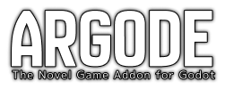

# Argode



Godot Engine用の強力で柔軟なビジュアルノベルフレームワーク。インタラクティブな物語の制作をシンプルで楽しいものにします。

## 🌟 機能

### 📖 ビジュアルノベルフレームワーク
- **RGDスクリプト言語**: ビジュアルノベル向けの習得しやすいカスタムスクリプト言語
- **キャラクターシステム**: 複数のスプライト、表情、ボイスセットを持つキャラクター定義
- **シーン管理**: 背景、キャラクター、UIエレメント間のシームレスな遷移
- **テキストアニメーション**: 美しいタイプライター効果とテキストアニメーション
- **音声統合**: 背景音楽、効果音、音声演技のサポート

### 💾 高度なセーブシステム
- **スクリーンショットサムネイル**: セーブスロット用の自動Base64エンコードスクリーンショットサムネイル
- **一時的なスクリーンショット**: UI要素を含まない綺麗なセーブサムネイル用のゲームシーンキャプチャ
- **オートセーブ**: 重要なストーリーポイントでの自動セーブ（スロット0）
- **手動セーブ**: プレイヤーが制御するセーブ（スロット1以上）
- **暗号化データ**: セーブデータのセキュリティ用AES暗号化

### 🎨 カスタマイズ可能UI
- **AdvScreen**: 高度なスクリーン管理システム
- **カスタムテーマ**: 完全にカスタマイズ可能なビジュアルテーマ
- **レスポンシブデザイン**: 異なる画面サイズに対応する適応型UI
- **メニュー統合**: 内蔵のゲームメニューと設定画面

### 🔧 開発者フレンドリー
- **カスタムコマンド**: GDScript統合による機能拡張
- **アセット管理**: 効率的なリソースロードと管理
- **デバッグツール**: 内蔵のデバッグとテストユーティリティ
- **ドキュメント**: 包括的な日英バイリンガルドキュメント

## 🚀 クイックスタート

### インストール

1. **リポジトリをクローン**:
   ```bash
   git clone https://github.com/AheadGameStudio/Argode.git
   cd Argode
   ```

2. **Godotで開く**:
   - Godot Engine（4.x必須）を起動
   - 「インポート」をクリックし、`project.godot`ファイルを選択
   - プロジェクトのインポートとコンパイルが完了するまで待機

3. **デモを実行**:
   - F5を押すか、再生ボタンをクリック
   - プロンプトが表示されたら`scenes/ui/base_ui.tscn`をメインシーンとして選択

### 基本的な使用方法

1. **最初のシナリオを作成**:
   ```rgd
   # scenarios/my_story.rgd
   character yuko "Yuko" color:#4A90E2
   
   label start:
   
       scene bg common/bg_room.png
       
       yuko happy "こんにちは！Argodeへようこそ！"
       yuko normal "これがあなたの最初のビジュアルノベルシーンです。"
       
       menu:
           "ストーリーを続ける":
               yuko excited "素晴らしい！もっと多くの機能を探索しましょう..."
               jump next_scene
           "ゲームをセーブ":
               save 1
               yuko normal "ゲームをセーブしました！いつでもロードできます。"
               jump next_scene
   
   label next_scene:
   
       yuko normal "Argodeを試してくれてありがとう！"
       return
   ```

2. **シナリオをロード**:
   ```gdscript
   # GDScriptコード内で
   ArgodeSystem.load_scenario("res://scenarios/my_story.rgd")
   ```

## 📚 ドキュメント

- **English**: [Full Documentation](https://aheadgamestudio.github.io/Argode/)
- **日本語**: [完全なドキュメント](https://aheadgamestudio.github.io/Argode/ja/)

### 主要トピック
- [はじめに](docs/getting-started/quick-start.ja.md)
- [RGDスクリプトリファレンス](docs/script/rgd-syntax.ja.md)
- [セーブ・ロードシステム](docs/save-load/index.ja.md)
- [カスタムコマンド](docs/custom-commands/overview.ja.md)
- [APIリファレンス](docs/api/argode-system.ja.md)

## 🎮 コアコマンド

### 基本コマンド
- `character` - スプライトとプロパティを持つキャラクターを定義
- `scene` - 背景画像とシーンを設定
- `music` - 背景音楽を再生
- `sound` - 効果音を再生
- `menu` - インタラクティブな選択肢を作成

### セーブシステムコマンド
- `save [slot]` - 指定スロット（1以上）にゲームをセーブ
- `load [slot]` - 指定スロット（0以上）からゲームをロード
- `capture` - 綺麗なセーブサムネイル用の一時スクリーンショットを撮影

### 高度なコマンド
- `fade` - 画面遷移と効果
- `wait` - タイミング制御のための実行一時停止
- `define` - 再利用可能な定義を作成
- `variable` - ゲーム変数を管理

## 🛠️ 開発

### 要件
- Godot Engine 4.x
- GDScriptの基本知識（カスタムコマンド用）

### 開発ツール

#### VS Code RGDシンタックスハイライター
最高の開発体験のために、公式VS Code拡張機能をインストールしてください：

**[Argode RGD Syntax Highlighter](https://github.com/AheadGameStudio/Argode-rgd-syntax-highlighter)**

✨ **機能:**
- **シンタックスハイライト**: 美しいカラーテーマによるRGDスクリプト構文の完全サポート
- **スマートインデント**: ラベル、メニュー、選択肢の自動インデント
- **コード折りたたみ**: より良い整理のための折りたたみ可能なラベルブロック
- **Ren'Py風体験**: ビジュアルノベル開発者に馴染みのあるシンタックスハイライト

📦 **インストール:**
1. [リリースページ](https://github.com/AheadGameStudio/Argode-rgd-syntax-highlighter)から`.vsix`ファイルをダウンロード
2. VS Codeを開く → 拡張機能 (Ctrl+Shift+X)
3. "..." → "VSIXからインストール" をクリック
4. ダウンロードしたファイルを選択

### プロジェクト構造
```
addons/argode/          # コアフレームワークファイル
├── core/               # メインシステムコンポーネント
├── builtin/           # 組み込みコマンド
├── commands/          # コマンドハンドリングシステム
└── managers/          # ゲーム状態マネージャー

custom/                 # カスタムコマンド（オプション）
└── commands/          # カスタムコマンド実装

definitions/           # アセットとキャラクター定義
├── assets.rgd         # 画像、音声、UI定義
├── characters.rgd     # キャラクター定義
└── variables.rgd      # グローバル変数定義

scenarios/             # ストーリースクリプト（.rgdファイル）
└── main.rgd           # メインシナリオエントリーポイント

ルートファイル:
├── project.godot      # Godotプロジェクトファイル
└── README.md          # このファイル
```

**ドキュメント:** 完全なドキュメントは [https://aheadgamestudio.github.io/Argode/](https://aheadgamestudio.github.io/Argode/) でオンライン閲覧可能です。

**注意:** 開発ファイル（test/, tools/, assets/, scenes/, docs/など）はフレームワークをクリーンで焦点を絞ったものに保つため、配布から除外されています。

### カスタムコマンドの作成
```gdscript
# custom/commands/MyCommand.gd
extends BaseCustomCommand

func _init():
    command_name = "mycommand"
    description = "私のカスタムコマンド"

func execute(args: Array, context: Dictionary) -> Dictionary:
    # カスタムロジックをここに記述
    return {"success": true}
```

## 🤝 コントリビューション

コントリビューションを歓迎します！プルリクエストを提出する前に、[コントリビューションガイドライン](CONTRIBUTING.md)をお読みください。

1. リポジトリをフォーク
2. 機能ブランチを作成
3. 変更を加える
4. 該当する場合はテストを追加
5. プルリクエストを提出

## 📄 ライセンス

このプロジェクトはMITライセンスの下でライセンスされています。詳細は[LICENSE](LICENSE)ファイルをご覧ください。

## 🔗 リンク

- **ドキュメント**: https://aheadgamestudio.github.io/Argode/
- **VS Code拡張機能**: https://github.com/AheadGameStudio/Argode-rgd-syntax-highlighter
- **Issues**: https://github.com/AheadGameStudio/Argode/issues
- **Discussions**: https://github.com/AheadGameStudio/Argode/discussions

## 🙏 謝辞

ビジュアルノベル開発コミュニティのためにArgodeをより良くすることに協力してくれるすべてのコントリビューターに感謝します。

---

**Godot Engineを使用するビジュアルノベルクリエイターのために❤️を込めて作成**
