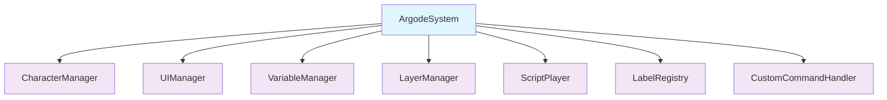
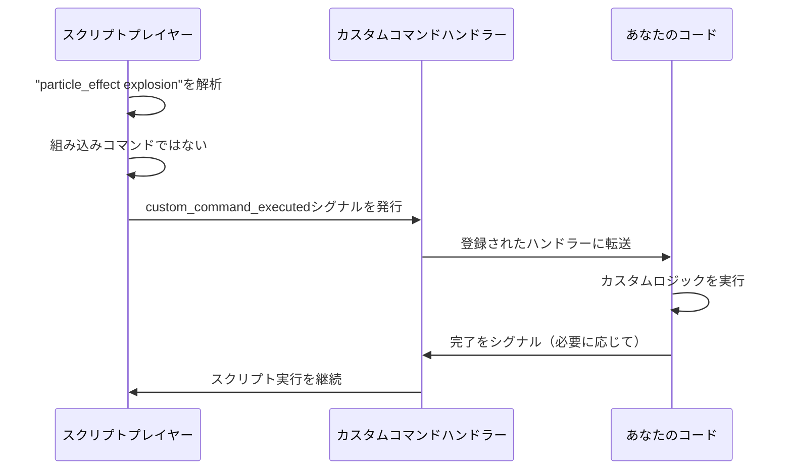
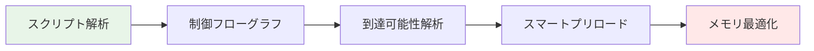

# 設計思想

Argodeは**拡張性**、**柔軟性**、**開発者の利便性**を基盤として構築されています。このページでは、フレームワークのあらゆる側面を形成するコア設計原則について説明します。

## 🏗️ シングルオートロードアーキテクチャ

!!! success "クリーンな統合"
    
    Argodeは、あなたのGodotプロジェクトに**ただ一つのシングルトン**である`ArgodeSystem`のみを導入します。他のすべてのマネージャーは子ノードとして整理され、グローバル名前空間の汚染を最小限に抑え、プロジェクトのクリーンな統合を実現します。



このアプローチにより以下が提供されます：

- **予測可能な構造**: すべてのコンポーネントが簡単に発見できる
- **競合なし**: 既存のオートロードとの干渉なし
- **簡単なデバッグ**: トラブルシューティングのための明確な階層
- **シンプルなセットアップ**: オートロードを一つ追加するだけで準備完了

## 📝 スクリプト中心のアセット定義

ビジュアルノベルフレームワークのベストプラクティスに従い、**ほぼすべてがスクリプトファイルで定義されます**。ライターはプレーンテキストファイルで作業でき、複雑なエディターワークフローの必要性を減らします。

### 定義ステートメント

```rgd
# 表情と色付きキャラクター
character alice "アリス" color=#ff69b4
character bob "ボブ" color=#4169e1

# スマートパス解決付き画像  
image bg_forest "backgrounds/forest_day.jpg"
image alice_happy "characters/alice/happy.png"

# プリロードオプション付きオーディオ
audio bgm_main "music/main_theme.ogg" preload=true
audio sfx_door "sounds/door_open.wav"

# エフェクト用カスタムシェーダー
shader screen_blur "shaders/blur.gdshader"
```

### メリット

- **ライターフレンドリー**: 複雑なUI階層のナビゲートが不要
- **バージョン管理**: すべての定義が追跡可能なテキストファイル
- **バッチ操作**: アセットの名前変更、再整理、複製が簡単
- **ドキュメント化**: 定義がインライン文書として機能

## 🎯 究極の拡張性フレームワーク

Argodeの力の核心は、その**シグナルベース拡張システム**にあります。未知のコマンドやタグは自動的にシグナルとして転送され、無制限のカスタマイゼーションが可能です。

### 仕組み



### 実装例

```gdscript
# あなたのゲームコード内
func _ready():
    ArgodeSystem.ScriptPlayer.custom_command_executed.connect(_handle_custom_command)

func _handle_custom_command(command_name: String, parameters: Dictionary, line: String):
    match command_name:
        "particle_effect":
            var effect_name = parameters.get("arg0", "default")
            spawn_particle_effect(effect_name)
        "screen_shake":
            var intensity = parameters.get("intensity", 5.0)
            var duration = parameters.get("duration", 0.5) 
            shake_screen(intensity, duration)
```

これにより以下が可能になります：

- **無制限のコマンド**: 想像できるあらゆるエフェクトや機能の追加
- **ゲーム固有のロジック**: ユニークなメカニクスとの統合
- **サードパーティプラグイン**: コミュニティによるコマンドライブラリの作成
- **将来への対応**: 新機能が既存スクリプトを破綻させない

## 🧠 予測的アセット管理

Argodeは起動時にスクリプト構造全体を解析して**制御フローグラフ**を構築し、インテリジェントなアセットプリロードを可能にします。

### 静的解析



### メリット

- **高速ロード**: 必要な時にアセットが瞬時に表示
- **メモリ効率**: 必要なアセットのみメモリに保持  
- **自動最適化**: 手動プリロード管理が不要
- **分岐予測**: プレイヤーの選択候補を予測

### 例

```rgd
label forest_scene:
    scene bg_forest with fade      # ← 森の背景をプリロード
    show alice happy at center     # ← alice_happy画像をプリロード
    alice "探検しましょう！"
    
    menu:
        "森の奥深くへ":   # ← deeper_forestアセットをプリロード
            jump deeper_forest     
        "村へ戻る":       # ← villageアセットをプリロード
            jump village_entrance
```

## 🎨 柔軟なレイヤーアーキテクチャ

Argodeは特定のシーン構造を強制しません。代わりに、どのCanvasLayerがどの目的を果たすかを定義する**ロールマッピング**を使用します。

### ロールベース割り当て

```gdscript
# メインシーンセットアップ内
ArgodeSystem.LayerManager.setup_layer_roles({
    "background": $BackgroundLayer,
    "characters": $CharacterLayer, 
    "ui": $UILayer,
    "effects": $EffectsLayer
})
```

### 適応性

この設計により以下がサポートされます：

- **既存プロジェクト**: 現在のシーン構造との統合
- **カスタムレイアウト**: 必要な数のレイヤーを使用
- **複雑な階層**: ネストされたUIとエフェクトレイヤーのサポート
- **プラットフォーム最適化**: モバイル/デスクトップ向けの異なるレイヤー戦略

## 🖥️ 高度なUIフレームワーク

`AdvScreen`システムは、スクリプトシステムとシームレスに連携できる複雑なユーザーインターフェースのための堅牢な基盤を提供します。

### スクリーン機能

```gdscript
extends AdvScreen

func _ready():
    # UIからの直接スクリプト操作
    call_script_label("character_info") 
    
    # ストーリーに影響する変数設定
    set_story_variable("viewed_profile", true)
    
    # 複雑なワークフローのためのスクリーンスタック
    call_screen("inventory_detail", {"item_id": "magic_sword"})
```

### 機能

- **スクリプト統合**: UIがストーリーイベントをトリガー可能
- **スクリーンスタック**: モーダルダイアログとネストされたインターフェース  
- **データ受け渡し**: スクリーン間の豊富なパラメータシステム
- **レスポンシブデザイン**: 自動レイアウト適応

## 🔄 ホットリロードと開発体験

Argodeは**迅速な反復**を念頭に設計され、開発中のライブアップデートをサポートします。

### 開発機能

- **スクリプトホットリロード**: 再起動なしで変更が即座に反映
- **ラベルレジストリ更新**: 新しいシーンの自動検出  
- **変数検査**: ストーリーステートのリアルタイムデバッグ
- **コマンド検証**: 構文エラーの即座フィードバック

### IDE統合

- **VS Code拡張**: `.rgd`ファイルの完全なシンタックスハイライト
- **IntelliSenseサポート**: コマンドと変数の自動補完
- **エラー検出**: スクリプト構文のリアルタイム検証
- **プロジェクトテンプレート**: 新しいビジュアルノベルのクイックセットアップ

## 🎪 パフォーマンス哲学

Argodeは**使いやすさ**と**パフォーマンス最適化**をインテリジェントなデフォルトとオプションの微調整によってバランスします。

### スマートデフォルト

- 自動テクスチャ形式選択
- インテリジェントなガベージコレクションタイミング
- プラットフォームベースの適応品質設定
- 非重要アセットの遅延ロード

### パフォーマンスノブ

必要なプロジェクトのために、Argodeは以下を公開します：

- 手動メモリ管理制御
- カスタムアセット読み込み戦略  
- パフォーマンスプロファイリングフック
- プラットフォーム固有の最適化

---

この設計思想により、Argodeはプロジェクトと共に成長します—シンプルなビジュアルノベルから、カスタムメカニクスと高度なUIシステムを持つ複雑なインタラクティブ体験まで。

[システム概要について学ぶ →](system-overview.ja.md){ .md-button }
[コアコンポーネントを見る →](core-components.ja.md){ .md-button }
