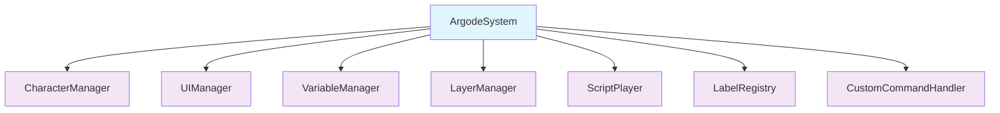
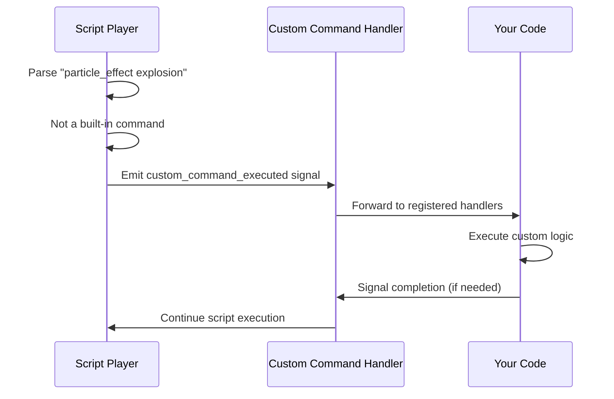
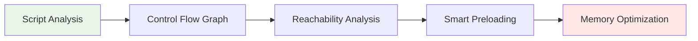

# Design Philosophy

Argode is built on a foundation of **extensibility**, **flexibility**, and **developer convenience**. This page outlines the core design principles that shape every aspect of the framework.

## 🏗️ Single Autoload Architecture

!!! success "Clean Integration"
    
    Argode introduces **only one singleton** to your Godot project: `ArgodeSystem`. All other managers are organized as child nodes, ensuring minimal global namespace pollution and clean project integration.



This approach provides:

- **Predictable structure**: All components are easily discoverable
- **No conflicts**: Won't interfere with your existing autoloads
- **Easy debugging**: Clear hierarchy for troubleshooting
- **Simple setup**: Add one autoload and you're ready to go

## 📝 Script-Centric Asset Definition

Following visual novel framework best practices, **almost everything is defined in script files**. Writers can work with plain text files, reducing the need for complex editor workflows.

### Definition Statements

```rgd
# Characters with expressions and colors
character alice "Alice" color=#ff69b4
character bob "Bob" color=#4169e1

# Images with smart path resolution  
image bg_forest "backgrounds/forest_day.jpg"
image alice_happy "characters/alice/happy.png"

# Audio with preloading options
audio bgm_main "music/main_theme.ogg" preload=true
audio sfx_door "sounds/door_open.wav"

# Custom shaders for effects
shader screen_blur "shaders/blur.gdshader"
```

### Benefits

- **Writer-friendly**: No need to navigate complex UI hierarchies
- **Version control**: All definitions are in trackable text files
- **Batch operations**: Easy to rename, reorganize, or duplicate assets
- **Documentation**: Definitions serve as inline documentation

## 🎯 Ultimate Extensibility Framework

The heart of Argode's power lies in its **signal-based extensibility system**. Unknown commands and tags are automatically forwarded as signals, allowing unlimited customization.

### How It Works



### Example Implementation

```gdscript
# In your game code
func _ready():
    ArgodeSystem.ScriptPlayer.custom_command_executed.connect(_handle_custom_command)

func _handle_custom_command(command_name: String, parameters: Dictionary, line: String):
    match command_name:
        "particle_effect":
            var effect_name = parameters.get("arg0", "default")
            spawn_particle_effect(effect_name)
        "screen_shake":
            var intensity = parameters.get("intensity", 5.0)
            var duration = parameters.get("duration", 0.5) 
            shake_screen(intensity, duration)
```

This enables:

- **Unlimited commands**: Add any effect or feature you can imagine
- **Game-specific logic**: Integrate with your unique mechanics
- **Third-party plugins**: Community can create command libraries
- **Future-proof**: New features won't break existing scripts

## 🧠 Predictive Asset Management

Argode analyzes your entire script structure at startup to build a **control flow graph**, enabling intelligent asset preloading.

### Static Analysis



### Benefits

- **Faster loading**: Assets appear instantly when needed
- **Memory efficiency**: Only necessary assets are kept in memory  
- **Automatic optimization**: No manual preload management required
- **Branch prediction**: Anticipates likely player choices

### Example

```rgd
label forest_scene:
    scene bg_forest with fade      # ← Will preload forest background
    show alice happy at center     # ← Will preload alice_happy image
    alice "Let's explore!"
    
    menu:
        "Go deeper into forest":   # ← Preloads deeper_forest assets
            jump deeper_forest     
        "Return to village":       # ← Preloads village assets
            jump village_entrance
```

## 🎨 Flexible Layer Architecture

Argode doesn't impose a specific scene structure. Instead, you define **role mappings** that tell the system which CanvasLayers serve which purposes.

### Role-Based Assignment

```gdscript
# In your main scene setup
ArgodeSystem.LayerManager.setup_layer_roles({
    "background": $BackgroundLayer,
    "characters": $CharacterLayer, 
    "ui": $UILayer,
    "effects": $EffectsLayer
})
```

### Adaptability

This design supports:

- **Existing projects**: Integrate with your current scene structure
- **Custom layouts**: Use as many or as few layers as needed
- **Complex hierarchies**: Support for nested UI and effect layers
- **Platform optimization**: Different layer strategies for mobile/desktop

## 🖥️ Advanced UI Framework

The `AdvScreen` system provides a robust foundation for complex user interfaces that can interact seamlessly with the script system.

### Screen Capabilities

```gdscript
extends AdvScreen

func _ready():
    # Direct script manipulation from UI
    call_script_label("character_info") 
    
    # Set variables that affect story
    set_story_variable("viewed_profile", true)
    
    # Stack screens for complex workflows
    call_screen("inventory_detail", {"item_id": "magic_sword"})
```

### Features

- **Script integration**: UI can trigger story events
- **Screen stacking**: Modal dialogs and nested interfaces  
- **Data passing**: Rich parameter system between screens
- **Responsive design**: Automatic layout adaptation

## 🔄 Hot Reloading & Development Experience

Argode is designed with **rapid iteration** in mind, supporting live updates during development.

### Development Features

- **Script hot reloading**: Changes appear instantly without restart
- **Label registry updates**: New scenes detected automatically  
- **Variable inspection**: Real-time debugging of story state
- **Command validation**: Immediate feedback on syntax errors

### IDE Integration

- **VS Code extension**: Full syntax highlighting for `.rgd` files
- **IntelliSense support**: Auto-completion for commands and variables
- **Error detection**: Real-time validation of script syntax
- **Project templates**: Quick setup for new visual novels

## 🎪 Performance Philosophy

Argode balances **ease of use** with **performance optimization** through intelligent defaults and optional fine-tuning.

### Smart Defaults

- Automatic texture format selection
- Intelligent garbage collection timing
- Adaptive quality settings based on platform
- Lazy loading of non-critical assets

### Performance Knobs

For projects that need it, Argode exposes:

- Manual memory management controls
- Custom asset loading strategies  
- Performance profiling hooks
- Platform-specific optimizations

---

This design philosophy ensures that Argode grows with your project—from simple visual novels to complex interactive experiences with custom mechanics and advanced UI systems.

[Learn About System Overview →](system-overview.md){ .md-button }
[View Core Components →](core-components.md){ .md-button }
