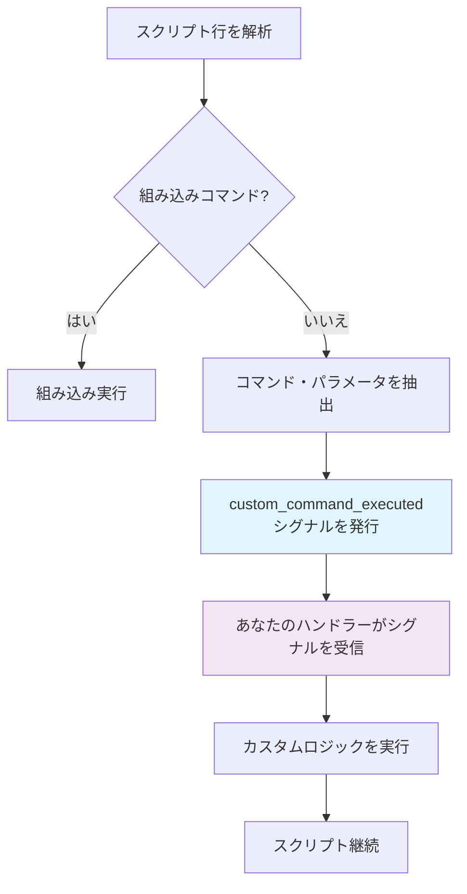

# カスタムコマンド概要

Argodeの最も強力な機能の一つは、カスタムコマンドによる**無限の拡張性**です。組み込みスクリプトパーサーが認識しないコマンドは、自動的にシグナルとして転送され、ゲーム固有の機能をシームレスに実装できます。

## 🎯 カスタムコマンドの仕組み

Argodeがスクリプト内で未知のコマンドに遭遇すると、以下のプロセスを実行します：



## 📝 基本例

画面揺れエフェクトのカスタムコマンドを作成してみましょう：

### スクリプト内 (story.rgd)
```rgd
label earthquake_scene:
    narrator "地面が揺れ始める！"
    screen_shake intensity=8.0 duration=2.0
    narrator "すごい揺れだった！"
```

### コード内 (Main.gd)
```gdscript
extends Control

func _ready():
    # カスタムコマンドシグナルに接続
    ArgodeSystem.ScriptPlayer.custom_command_executed.connect(_handle_custom_command)

func _handle_custom_command(command_name: String, parameters: Dictionary, line: String):
    match command_name:
        "screen_shake":
            var intensity = parameters.get("intensity", 5.0)
            var duration = parameters.get("duration", 1.0)
            _shake_screen(intensity, duration)

func _shake_screen(intensity: float, duration: float):
    var tween = create_tween()
    var original_position = global_position
    
    for i in range(int(duration * 60)):  # 60 FPS
        var offset = Vector2(
            randf_range(-intensity, intensity),
            randf_range(-intensity, intensity)
        )
        tween.tween_to(global_position + offset, 1.0/60.0)
    
    tween.tween_to(original_position, 0.1)
```

## 🔧 パラメータ解析

Argodeは複数の形式でパラメータを自動解析します：

### キー・値パラメータ
```rgd
particle_effect type="explosion" x=100 y=200 scale=1.5
```
```gdscript
# parameters["type"] = "explosion"
# parameters["x"] = 100
# parameters["y"] = 200  
# parameters["scale"] = 1.5
```

### 位置パラメータ
```rgd
fade_to_color red 2.0 ease_in
```
```gdscript
# parameters["arg0"] = "red"
# parameters["arg1"] = 2.0
# parameters["arg2"] = "ease_in"
# parameters["_count"] = 3
```

### 混合パラメータ
```rgd
spawn_enemy goblin attack=15 x=300 magical=true
```
```gdscript
# parameters["arg0"] = "goblin"
# parameters["attack"] = 15
# parameters["x"] = 300
# parameters["magical"] = true
```

## 🎮 組み込みカスタムコマンド

Argodeは、ベストプラクティスを示す事前構築されたカスタムコマンドを含んでいます：

### ウィンドウエフェクト
```rgd
window shake intensity=5.0 duration=0.5
window fullscreen toggle
window resize 1280 720
```

### スクリーンエフェクト  
```rgd
screen_tint color=#ff0000 intensity=0.3 duration=1.0
screen_flash color=#ffffff duration=0.1
screen_blur intensity=2.0 duration=0.5
```

### 高度なエフェクト
```rgd
particle_effect explosion x=400 y=300
camera_shake intensity=3.0 duration=1.5 
layer_tint background color=#0066cc intensity=0.5
```

[すべての組み込みコマンドを見る →](built-in.ja.md){ .md-button }

## ⚡ 同期 vs 非同期コマンド

コマンドは**同期**（スクリプト実行をブロック）または**非同期**（並行実行）のどちらでも可能です：

### 非同期（デフォルト）
```gdscript
func _handle_custom_command(command_name: String, parameters: Dictionary, line: String):
    match command_name:
        "play_sound":
            # スクリプトは即座に継続
            audio_player.play_sound(parameters.get("file"))
```

### 同期
```gdscript
func _handle_custom_command(command_name: String, parameters: Dictionary, line: String):
    match command_name:
        "wait":
            # スクリプトは完了まで待機
            var duration = parameters.get("duration", 1.0)
            await get_tree().create_timer(duration).timeout
            ArgodeSystem.CustomCommandHandler.synchronous_command_completed.emit()
```

## 🎨 高度な使用例

### ゲームメカニクス統合
```rgd
# RPG風コマンド
add_item "Magic Sword" quantity=1
gain_experience 250
level_up_check

# インベントリ管理
show_inventory category="weapons"
equip_item "Magic Sword"
```

### ビジュアルエフェクト
```rgd
# 複雑なアニメーション
animate_character alice slide_in from=left duration=0.8 easing=bounce
morph_background from=day to=night duration=3.0
create_weather rain intensity=0.7
```

### カスタムUI
```rgd
# ミニゲームとインタラクティブ要素
start_minigame "puzzle_box" difficulty=3
show_map location="forest" interactive=true
display_stats character="alice" style="detailed"
```

## 📚 ベストプラクティス

### 1. 一貫した命名
明確で説明的なコマンド名を使用：
```rgd
✅ screen_shake intensity=5.0
✅ play_music "battle_theme" volume=0.8
❌ shake 5
❌ music battle_theme  
```

### 2. パラメータ検証
ハンドラーで常にパラメータを検証：
```gdscript
func _handle_custom_command(command_name: String, parameters: Dictionary, line: String):
    match command_name:
        "screen_shake":
            var intensity = clamp(parameters.get("intensity", 5.0), 0.1, 50.0)
            var duration = clamp(parameters.get("duration", 1.0), 0.1, 10.0)
            _shake_screen(intensity, duration)
```

### 3. エラーハンドリング
意味のあるエラーメッセージを提供：
```gdscript
func _handle_play_sound(parameters: Dictionary):
    var file = parameters.get("file", "")
    if file.is_empty():
        push_error("play_soundコマンドには'file'パラメータが必要です")
        return
        
    if not FileAccess.file_exists("res://audio/" + file):
        push_error("オーディオファイルが見つかりません: " + file)
        return
        
    audio_player.stream = load("res://audio/" + file)
    audio_player.play()
```

### 4. ドキュメント化
カスタムコマンドを文書化：
```gdscript
## 指定された強度と継続時間で画面を揺らす
## パラメータ:
##   intensity (float): 揺れの強さ (0.1 - 50.0, デフォルト: 5.0)  
##   duration (float): 揺れの継続時間(秒) (0.1 - 10.0, デフォルト: 1.0)
## 例: screen_shake intensity=3.0 duration=0.8
func _handle_screen_shake(parameters: Dictionary):
    # 実装...
```

## 🚀 次のステップ

独自のカスタムコマンドを作成する準備はできましたか？

- **[組み込みコマンドリファレンス](built-in.ja.md)**: 利用可能なすべてのコマンドを確認
- **[カスタムコマンド作成](creating.ja.md)**: ステップバイステップ実装ガイド  
- **[高度なパターン](../examples/custom-features.ja.md)**: 複雑なコマンド例

---

カスタムコマンドシステムによりArgodeは無限に拡張可能です—シンプルなエフェクトから複雑なゲームメカニクスまで、何でも可能です！

[組み込みコマンドを見る →](built-in.ja.md){ .md-button .md-button--primary }
[独自コマンドを作る →](creating.ja.md){ .md-button }
