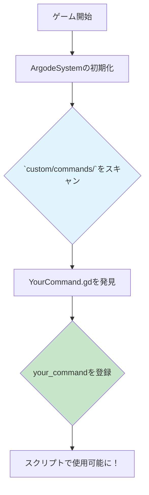

# カスタムコマンド概要

Argodeの最も強力な機能の一つが、カスタムコマンドによる拡張性です。簡単なスクリプトファイルを作成するだけで、ゲーム固有の新しいロジックを追加したり、他のGodotシステムと連携したり、プロジェクト独自のニーズに合わせてエンジンの能力を拡張したりすることができます。

Argodeは、カスタムコマンドに対して **オブジェクト指向のクラスベース** のアプローチを採用しています。各コマンドは、`BaseCustomCommand`クラスを継承した独自の`.gd`ファイルです。これにより、コマンドはモジュール化され、再利用可能で、管理が容易になります。

## 🚀 コマンドの自動発見

新しいコマンドシステムの最大の特徴は **自動発見機能** です。もはやシグナルを手動で接続したり、コマンドを登録したりする必要はありません。コマンドの`.gd`ファイルを`res://custom/commands/`ディレクトリに配置するだけで、ゲーム開始時にArgodeが自動的にそれを検出して登録します。



## 🛠️ カスタムコマンドの作成

コンソールにメッセージを出力する簡単な`hello_world`コマンドを作成してみましょう。

**ステップ1: ファイルの作成**

`res://custom/commands/`ディレクトリ内に`HelloWorldCommand.gd`という名前で新しいファイルを作成します。

**ステップ2: コードの記述**

ファイルを開き、以下のコードを追加します:

```gdscript
# res://custom/commands/HelloWorldCommand.gd
@tool
class_name HelloWorldCommand
extends BaseCustomCommand

# コマンドが最初に登録されるときに呼び出される
func _init():
    # .rgdスクリプトで使われる名前
    command_name = "hello_world"
    
    # ドキュメントやツール用の簡単な説明
    description = "コンソールに挨拶を出力します。"
    
    # コマンドの使い方に関するヘルプテキスト
    help_text = "hello_world [name=string]"

# スクリプトでコマンドが実行されたときに呼び出される
func execute(parameters: Dictionary, adv_system: Node) -> void:
    # "name"という名前のパラメータを取得し、デフォルト値として"World"を設定
    var target_name = parameters.get("name", "World")
    
    # メッセージを出力
    print("Hello, " + target_name + "!")
    
    # デバッグ用にゲーム内コンソールにログを記録
    log_command("Printed greeting to " + target_name)
```

**ステップ3: スクリプトで使用する**

これで、任意の`.rgd`ファイルで新しいコマンドを使用できます:

```rgd
label start:
    # "Hello, World!"と出力される
    hello_world

    # "Hello, Yuko!"と出力される
    hello_world name="Yuko"
```

以上です！残りの処理はArgodeが自動的に行います。

## ⚙️ `BaseCustomCommand`クラス

カスタムコマンドクラスは`BaseCustomCommand`を継承し、いくつかのプロパティとメソッドをオーバーライドできます:

- `command_name` (string): **必須。** スクリプトで使用されるコマンド名。
- `description` (string): コマンドが何をするかの短い説明。
- `help_text` (string): 構文とパラメータを説明する長いテキスト。
- `execute(parameters: Dictionary, adv_system: Node)`: **必須。** コマンドの主要なロジック。
- `is_synchronous() -> bool`: スクリプトのフローを制御するためにこれをオーバーライドします（下記参照）。
- `execute_internal_async(parameters: Dictionary, adv_system: Node)`: ロジックの非同期バージョン。

## ⚡ 同期コマンドと非同期コマンド

コマンドには **非同期**（スクリプトは即座に続行）と **同期**（コマンドが終了するまでスクリプトを待機）の2種類があります。

### 非同期（デフォルト）

デフォルトでは、コマンドは非同期です。`execute`メソッドが呼び出され、スクリプトプレイヤーはすぐに次の行に進みます。これは、効果音の再生など、ゲームの流れを妨げるべきでないアクションに適しています。

### 同期

コマンドを同期的にするには、次の2つのことを行う必要があります:

1.  `is_synchronous()`をオーバーライドして`true`を返すようにする。
2.  ロジックを`execute_internal_async(params, adv_system)`内に記述する。

`wait`コマンドが完璧な例です:

```gdscript
# ビルトインのWaitCommand.gdを簡略化したもの
@tool
class_name BuiltinWaitCommand
extends BaseCustomCommand

func _init():
    command_name = "wait"

# 1. このコマンドがスクリプトをブロックすることをArgodeに伝える
func is_synchronous() -> bool:
    return true

# 2. 待機ロジックをexecuteの非同期版に記述する
func execute_internal_async(params: Dictionary, adv_system: Node) -> void:
    var duration = params.get("duration", 1.0)
    
    # 'await'キーワードがこの関数を一時停止させ、
    # is_synchronous()がtrueであるため、スクリプトプレイヤーも一時停止させる
    await adv_system.get_tree().create_timer(duration).timeout
    
    # タイマーが終了すると、スクリプトは再開される
```

## 📥 パラメータの処理

`execute`メソッドは、スクリプトから渡されたすべての引数を含む`parameters`ディクショナリを受け取ります。

**スクリプト:**
```rgd
my_command "first_arg" 123 an_option="some_value"
```

**`parameters`ディクショナリ:**
```gdscript
{
  "_raw": "first_arg 123 an_option=some_value", # 生の文字列
  "arg0": "first_arg",
  "arg1": 123,
  "an_option": "some_value"
}
```
ディクショナリの`.get(key, default_value)`メソッドを使用すると、パラメータに安全にアクセスできます。

## 📚 ベストプラクティス

- **1コマンド1ファイル:** 整理しやすくするために、各コマンドを独自のファイルに保持します。
- **明確な命名:** コマンドとパラメータには、説明的な名前を使用します。
- **`log_command()`の使用:** `execute`内で`log_command("My message")`を呼び出して、デバッグ情報をゲーム内コンソールに出力します。
- **優雅な失敗:** 必要なパラメータをチェックし、`log_error()`または`log_warning()`を使用して、クラッシュさせずに問題を報告します。

---

この強力なシステムを使えば、想像できるほとんどすべてのことを実現するためにArgodeを拡張できます。

[ビルトインコマンド一覧 →](built-in.md){ .md-button }