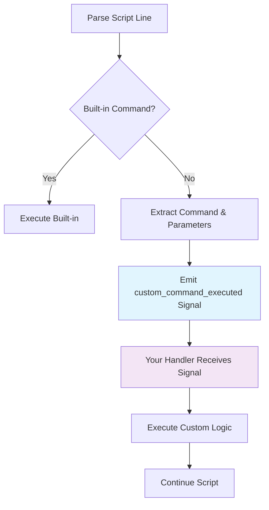

# Custom Commands Overview

One of Argode's most powerful features is its **unlimited extensibility** through custom commands. Any command not recognized by the built-in script parser is automatically forwarded as a signal, allowing you to implement game-specific functionality seamlessly.

## 🎯 How Custom Commands Work

When Argode encounters an unknown command in your script, it follows this process:



## 📝 Basic Example

Let's create a custom screen shake effect:

### In Your Script (story.rgd)
```rgd
label earthquake_scene:
    narrator "The ground begins to shake!"
    screen_shake intensity=8.0 duration=2.0
    narrator "That was intense!"
```

### In Your Code (Main.gd)
```gdscript
extends Control

func _ready():
    # Connect to the custom command signal
    ArgodeSystem.ScriptPlayer.custom_command_executed.connect(_handle_custom_command)

func _handle_custom_command(command_name: String, parameters: Dictionary, line: String):
    match command_name:
        "screen_shake":
            var intensity = parameters.get("intensity", 5.0)
            var duration = parameters.get("duration", 1.0)
            _shake_screen(intensity, duration)

func _shake_screen(intensity: float, duration: float):
    var tween = create_tween()
    var original_position = global_position
    
    for i in range(int(duration * 60)):  # 60 FPS
        var offset = Vector2(
            randf_range(-intensity, intensity),
            randf_range(-intensity, intensity)
        )
        tween.tween_to(global_position + offset, 1.0/60.0)
    
    tween.tween_to(original_position, 0.1)
```

## 🔧 Parameter Parsing

Argode automatically parses parameters in multiple formats:

### Key-Value Parameters
```rgd
particle_effect type="explosion" x=100 y=200 scale=1.5
```
```gdscript
# parameters["type"] = "explosion"
# parameters["x"] = 100
# parameters["y"] = 200  
# parameters["scale"] = 1.5
```

### Positional Parameters
```rgd
fade_to_color red 2.0 ease_in
```
```gdscript
# parameters["arg0"] = "red"
# parameters["arg1"] = 2.0
# parameters["arg2"] = "ease_in"
# parameters["_count"] = 3
```

### Mixed Parameters
```rgd
spawn_enemy goblin attack=15 x=300 magical=true
```
```gdscript
# parameters["arg0"] = "goblin"
# parameters["attack"] = 15
# parameters["x"] = 300
# parameters["magical"] = true
```

## 🎮 Built-in Custom Commands

Argode includes several pre-built custom commands that demonstrate best practices:

### Window Effects
```rgd
window shake intensity=5.0 duration=0.5
window fullscreen toggle
window resize 1280 720
```

### Screen Effects  
```rgd
screen_tint color=#ff0000 intensity=0.3 duration=1.0
screen_flash color=#ffffff duration=0.1
screen_blur intensity=2.0 duration=0.5
```

### Advanced Effects
```rgd
particle_effect explosion x=400 y=300
camera_shake intensity=3.0 duration=1.5 
layer_tint background color=#0066cc intensity=0.5
```

[View All Built-in Commands →](built-in.md){ .md-button }

## ⚡ Synchronous vs Asynchronous Commands

Commands can be either **synchronous** (block script execution) or **asynchronous** (run in parallel):

### Asynchronous (Default)
```gdscript
func _handle_custom_command(command_name: String, parameters: Dictionary, line: String):
    match command_name:
        "play_sound":
            # Script continues immediately
            audio_player.play_sound(parameters.get("file"))
```

### Synchronous
```gdscript
func _handle_custom_command(command_name: String, parameters: Dictionary, line: String):
    match command_name:
        "wait":
            # Script waits for completion
            var duration = parameters.get("duration", 1.0)
            await get_tree().create_timer(duration).timeout
            ArgodeSystem.CustomCommandHandler.synchronous_command_completed.emit()
```

## 🎨 Advanced Use Cases

### Game Mechanics Integration
```rgd
# RPG-style commands
add_item "Magic Sword" quantity=1
gain_experience 250
level_up_check

# Inventory management
show_inventory category="weapons"
equip_item "Magic Sword"
```

### Visual Effects
```rgd
# Complex animations
animate_character alice slide_in from=left duration=0.8 easing=bounce
morph_background from=day to=night duration=3.0
create_weather rain intensity=0.7
```

### Custom UI
```rgd
# Mini-games and interactive elements
start_minigame "puzzle_box" difficulty=3
show_map location="forest" interactive=true
display_stats character="alice" style="detailed"
```

## 📚 Best Practices

### 1. Consistent Naming
Use clear, descriptive command names:
```rgd
✅ screen_shake intensity=5.0
✅ play_music "battle_theme" volume=0.8
❌ shake 5
❌ music battle_theme  
```

### 2. Parameter Validation
Always validate parameters in your handlers:
```gdscript
func _handle_custom_command(command_name: String, parameters: Dictionary, line: String):
    match command_name:
        "screen_shake":
            var intensity = clamp(parameters.get("intensity", 5.0), 0.1, 50.0)
            var duration = clamp(parameters.get("duration", 1.0), 0.1, 10.0)
            _shake_screen(intensity, duration)
```

### 3. Error Handling
Provide meaningful error messages:
```gdscript
func _handle_play_sound(parameters: Dictionary):
    var file = parameters.get("file", "")
    if file.is_empty():
        push_error("play_sound command requires 'file' parameter")
        return
        
    if not FileAccess.file_exists("res://audio/" + file):
        push_error("Audio file not found: " + file)
        return
        
    audio_player.stream = load("res://audio/" + file)
    audio_player.play()
```

### 4. Documentation
Document your custom commands:
```gdscript
## Shakes the screen with specified intensity and duration
## Parameters:
##   intensity (float): Shake strength (0.1 - 50.0, default: 5.0)  
##   duration (float): Shake duration in seconds (0.1 - 10.0, default: 1.0)
## Example: screen_shake intensity=3.0 duration=0.8
func _handle_screen_shake(parameters: Dictionary):
    # Implementation...
```

## 🚀 Next Steps

Ready to create your own custom commands?

- **[Built-in Commands Reference](built-in.md)**: See all available commands
- **[Creating Custom Commands](creating.md)**: Step-by-step implementation guide  
- **[Advanced Patterns](../examples/custom-features.md)**: Complex command examples

---

The custom command system makes Argode infinitely extensible—from simple effects to complex game mechanics, anything is possible!

[View Built-in Commands →](built-in.md){ .md-button .md-button--primary }
[Create Your Own →](creating.md){ .md-button }
