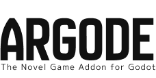

# Welcome to Argode

[](https://godotengine.org/)
[](LICENSE)
[](https://github.com/AheadGameStudio/Argode/releases)



## What is Argode?

**Argode** is a powerful visual novel framework built for **Godot Engine 4.0+**. Create stunning interactive stories with ease while maintaining full flexibility and extensibility.

## ✨ Key Features

!!! tip "🎯 **Design Philosophy**"
    
    Argode follows a **single-autoload architecture** with **ArgodeSystem** as the only global singleton. All managers are organized as child nodes, ensuring clean integration into any Godot project.

### 🎬 **Visual Novel Core**
- **RGD Script Language**: Intuitive scripting syntax for visual novels
- **Character System**: Dynamic character definitions with expressions and positioning
- **Background & Scene Management**: Smooth transitions and layered scenes
- **Choice Menus**: Interactive branching narratives
- **Save/Load System**: Complete game state management

### 🎨 **Advanced Features**
- **Custom Commands**: Unlimited extensibility through a powerful class-based system
- **Definition System**: Centralized asset and variable management
- **Layer Architecture**: Flexible scene structure with role-based assignment
- **UI Framework**: Professional AdvScreen system for complex interfaces
- **Asset Management**: Smart preloading and memory optimization

### 🛠️ **Developer Experience**
- **Single File Setup**: Import addon and you're ready to go
- **Hot Reloading**: Instant script updates during development  
- **Visual Studio Code Support**: Syntax highlighting extension available
- **Comprehensive Documentation**: Detailed guides and API reference
- **Example Projects**: Learn from working implementations

## 🚀 Quick Start

Get started with Argode in just a few minutes:

```gdscript
# 1. Add ArgodeSystem to your autoload
# 2. Create your first script file (e.g., scenarios/main.rgd)

# In your main Godot scene's script (e.g., Main.gd):
extends Control

func _ready():
    if ArgodeSystem:
        ArgodeSystem.start_script("res://scenarios/main.rgd", "start")
    else:
        print("ArgodeSystem not found! Make sure it's in autoload.")
```

[Get Started Now →](getting-started/quick-start.md){ .md-button .md-button--primary }
[View Examples →](examples/simple-vn.md){ .md-button }

## 📚 Documentation Sections

<div class="grid cards" markdown>

-   :material-rocket-launch: **Getting Started**
    
    ---
    
    Installation guides, basic setup, and your first visual novel
    
    [:octicons-arrow-right-24: Quick Start](getting-started/quick-start.md)

-   🏗️ **Architecture**
    
    ---
    
    Deep dive into Argode's design philosophy and core components
    
    [:octicons-arrow-right-24: Learn More](architecture/design-philosophy.md)

-   :material-script: **Script Reference**
    
    ---
    
    Complete RGD syntax reference with commands and examples
    
    [:octicons-arrow-right-24: RGD Syntax](script/rgd-syntax.md)

-   :material-puzzle: **Custom Commands**
    
    ---
    
    Extend Argode with your own commands and effects
    
    [:octicons-arrow-right-24: Custom Commands](custom-commands/overview.md)

-   :material-palette: **UI System**
    
    ---
    
    Build beautiful interfaces with the AdvScreen framework
    
    [:octicons-arrow-right-24: UI Framework](ui/advscreen.md)

-   ⚙️ **API Reference**
    
    ---
    
    Complete API documentation for all Argode components
    
    [:octicons-arrow-right-24: API Docs](api/argode-system.md)

</div>

## 🎮 Example Projects

See Argode in action with these example implementations:

- **[Simple Visual Novel](examples/simple-vn.md)**: Basic story with characters and choices
- **[Custom Features Demo](examples/custom-features.md)**: Advanced effects and custom commands  
- **[Mobile-Optimized](examples/best-practices.md)**: Performance tips for mobile deployment

## 🤝 Community & Support

- **GitHub**: [AheadGameStudio/Argode](https://github.com/AheadGameStudio/Argode)
- **Discord**: Join our community server
- **Issues**: Report bugs and request features

## 📄 License

Argode is released under the [MIT License](https://github.com/AheadGameStudio/Argode/blob/main/LICENSE). Free for both commercial and non-commercial use.

---

*Ready to create your visual novel? [Start with the Quick Start guide →](getting-started/quick-start.md)*
